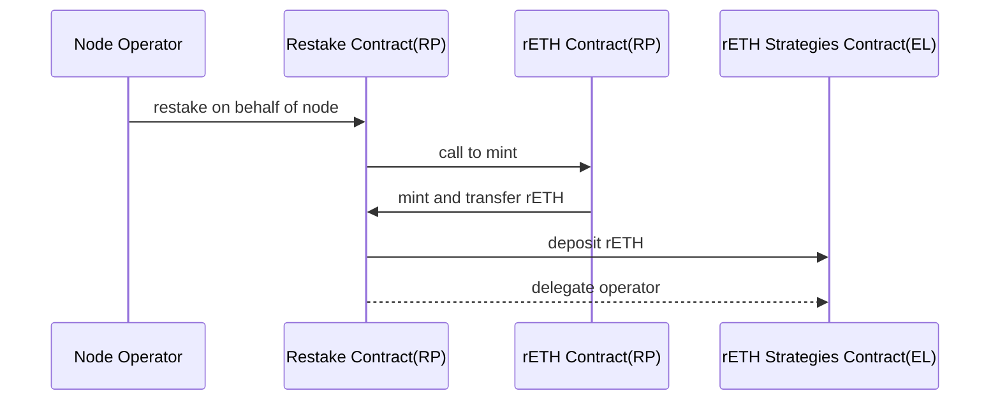
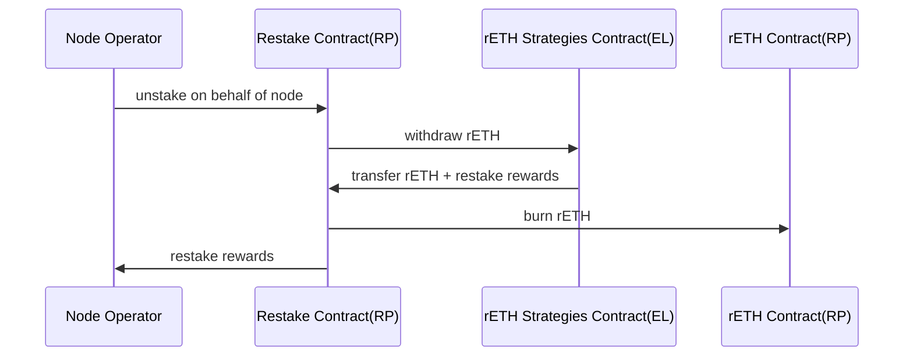

# Background

The community previously proposed a bounty for integrating EigenLayer through the EigenPod method. Integrating EigenLayer would allow node operators to participate in restaking with their 8 ETH node operator bond, which would generate additional rewards for node operators. Based on this, we propose another way to integrate EigenLayer, which is to allow node operators to participate in restaking through rETH. This method is mainly implemented through contracts and can also increase the supply of rETH.

# Abstract

This proposal presents a method for node operators to participate in EigenLayer restaking and earn restaking rewards through rETH. The method is mainly implemented through contracts, with minimal reliance on centralized services and no reliance on EIP-7002. Some modifications are required for oDAO nodes. The potential security risks include the addition of new mint and burn permissions, which could be abused.

# Specification

## Overview

Node operators can participate in EigenLayer restaking and earn restaking rewards through contracts and rETH.

Benefits:

- Node operators do not have the additional burden of operation and maintenance or AVS selection.
- The method is mainly implemented through contracts, with minimal reliance on centralized services. Some modifications are required for oDAO nodes.
- No reliance on EIP-7002

Drawbacks: the main concern is contract security, which requires evaluation and auditing by the core team.

- The new mint and burn permissions pose potential risks of abuse.
- The rETH owner belongs to the restaking contract, which is vulnerable to hacking

## Flow

### Restake

*The delegate-to-operator earnings feature will be implemented in Eigenlayer M2 and is not included in the current M1 version.*

### Unrestake

## Detail

### Node Operator

Restake & rETH Mint

- Grant the restaking contract permission to call the rETH `mint function`.
- Node operators can participate in restaking on behalf of their nodes.

Unstake

- Node operators can participate in unstaking on behalf of their nodes.
- rETH participating in restaking needs to be burned. A dedicated rETH `burn function` for restaking is required, as the current rETH `burn function` and does not involve operations such as ETH withdrawal.
- Node operators must unstake before exiting a node. **Smartnode** needs to add this check.

### rETH Rate

- `totalEthBalance`: Needs to include the 8 ETH that nodes have already staked in restaking.
- `rethSupply`: Increase the rETH minted when nodes participate in restaking.
- **oDAO Node**: When calculating validator balance, include the 8 ETH of nodes that have participated in restaking.

### Rewards Distribution

- Restake rewards belong to the node operator.
- The ETH burned from rETH - 8 ETH belongs to the deposit pool. This is because this part is considered interest income, and the node operator has already calculated it once. However, in the contract processing, there is actually no additional operation for this part.

## Risk

- The addition of new mint and burn permissions could be abused.
- The rETH owner belongs to the restaking contract, which is vulnerable to hacking.

## Plan

- Community review
- The core team review
- Operator delegate reseach
- If the proposal is approved, we will apply for a grant to cover the development costs. The main development task is to develop the restaking contract. However, the development of the rETH contract, oDAO, and smartnode will require the core team support.